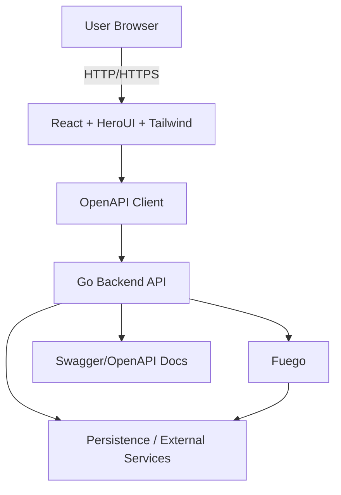

# Product Database

## Project Structure

```
product-database/
├── server/     # Go server API (GORM, Fuego)
├── client/     # Vite + React frontend
├── docs/        # Documentation (OpenAPI, Database)
```

---

## Development Setup

```sh
# Clone repository
git clone git@github.com:sec-o-simple/product-database.git
cd product-database
```

This is a monorepo. Each subproject (`server`, `client`) has its own setup instructions.

**Please refer to the individual README files** in `./server` and `./client` for detailed installation and development guidance:

- [`server/README.md`](./server/README.md)
- [`client/README.md`](./client/README.md)

## Architecture Overview

A modern web application with a **React + Tailwind + HeroUI** frontend and a **Go backend**. API contracts are defined via **OpenAPI/Swagger**, and asynchronous or background processing is handled through **Fuego**. The system emphasizes clear interface contracts, modularity, scalability, and great developer ergonomics.

### Tech Stack

- **Frontend:**  
  - React.js  
  - Tailwind CSS  
  - HeroUI (design system / component library)  
  - OpenAPI-based client for typed/fetching API consumption  

- **Backend:**  
  - Golang  
  - Fuego (background job / workflow orchestration)  
  - Swagger / OpenAPI for API specification and interactive docs  

### High-Level Architecture

_Install Mermaid-Extension for this architecture_


## Branching policy

When working on new features or fixing bugs, create a new branch based on main
and give it a meaningful name. Rebase or merge main regularly into your branch
in order to prevent large merge conflicts.

- Base all work off of the `main` branch.  
- Use descriptive branch names:  
  - Features: `feat/<description>` (e.g., `feat/navigation-redesign`)  
  - Fixes: `fix/<description>` (e.g., `fix/excessive-loading-time`)  
- Rebase or merge `main` frequently to avoid large conflicts.  
- Pull requests must follow the [Template](https://raw.githubusercontent.com/sec-o-simple/sec-o-simple/refs/heads/main/.github/pull_request_template.md)

- Commit messages should be clear and imperative. 

## Contributing

Please refer to this [document](CONTRIBUTING.md).

Key guidelines:

- Fork or branch off `main`.  
- Use descriptive branch names (`feat/...`, `fix/...`).  
- Ensure linting and automated tests pass before submitting.  
- Open a pull request using the template
- Address reviewer feedback promptly

## Security Considerations

Please refer to [`SECURITY-CONSIDERATIONS.md`](SECURITY-CONSIDERATIONS.md) for details about how product-database addresses the [OWASP Top 10 Web Application Security Risks](https://owasp.org/www-project-top-ten/).

[(back to top)](#bsi-secvisogram-csaf-20-web-editor)